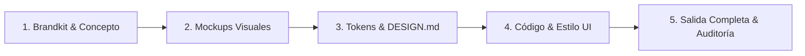

# 🚀 Taste Skills Suite: Guía Maestra de Uso y Flujo de Trabajo

Esta suite de 14 habilidades (`skills`) transforma el desarrollo frontend eliminando los diseños genéricos de IA (*anti-slop*) y produciendo interfaces con nivel de agencia internacional (**Awwwards**, **Linear**, **Apple**).

---

## 🧭 Mapa del Arsenal (14 Skills)

| Categoría | Skill | Propósito Clave |
|---|---|---|
| **Identidad & Branding** | `brandkit` | Genera tableros de identidad de marca, paletas de color calibradas, sistemas de logo y tipografía. |
| **Concepto Visual (Mockups)** | `imagegen-frontend-web` | Genera imágenes de referencia visual **sección por sección** (nunca comprime todo en una sola). |
| | `imagegen-frontend-mobile` | Genera conceptos de pantallas móviles nativas (iOS/Android) con mockups de teléfono discretos y de alta gama. |
| **Sistema & Tokens** | `stitch-design-taste` | Genera un archivo `DESIGN.md` con tokens semánticos, contrastes, espaciados y reglas visuales. |
| **Motores de Estilo (Aesthetic Engines)** | `design-taste-frontend` | Motor anti-slop v2 para landing pages y portfolios. Calibra 3 diales: Variación, Movimiento y Densidad. |
| | `design-taste-frontend-v1` | Versión clásica v1 del motor de diseño taste-skill. |
| | `high-end-visual-design` | Estándares de agencia: bordes sutiles, microinteracciones, profundidad y sombras de lujo. |
| | `gpt-taste` | Ingeniería de interacción nivel Awwwards: animaciones GSAP avanzadas (pinning, scrub), cuadrículas Bento sin huecos y regla de 2 líneas en H1. |
| | `minimalist-ui` | Estilo editorial limpio, paleta monocromática cálida, tipografía suiza, sin degradados saturados. |
| | `industrial-brutalist-ui` | Interfaces técnicas inspiradas en planos de ingeniería, fuentes monoespaciadas, alto contraste y datos densos. |
| **Codificación & Implementación** | `image-to-code` | Traduce las imágenes de referencia visual a código HTML/CSS/React con precisión de píxel. |
| | `full-output-enforcement` | **Imprescindible**: Prohíbe código truncado, omitido o con comentarios `// TODO`, forzando archivos completos y funcionales. |
| **Refactor & Auditoría** | `redesign-existing-projects` | Audita código existente, identifica patrones genéricos de IA y los rediseña a nivel premium. |
| **Descubrimiento** | `find-skills` | Localiza e instala nuevas habilidades desde repositorios comunitarios cuando se requieran. |

---

## ⚡ Flujo de Trabajo Recomendado (Pipeline de 5 Fases)

Para maximizar el resultado en cualquier proyecto (por ejemplo, `H2O Life`), sigue este orden secuencial:

### Fase 1: Identidad y Marca (`brandkit`)
* **Cuándo usarla:** Al iniciar un proyecto desde cero.
* **Prompt de ejemplo:**
  > *"Activa el skill `brandkit` para definir la identidad visual de 'H2O Life': una marca tecnológica y premium de hidratación y bienestar. Define paleta cromática, tipografías y concepto de logotipo."*

### Fase 2: Referencias Visuales (`imagegen-frontend-web` / `mobile`)
* **Cuándo usarla:** Para tener el concepto visual antes de escribir una sola línea de CSS.
* **Prompt de ejemplo:**
  > *"Usa `imagegen-frontend-web` para generar la dirección de arte del Hero y de la sección Bento Grid de características para H2O Life."*

### Fase 3: Tokens de Diseño (`stitch-design-taste`)
* **Cuándo usarla:** Para fijar las reglas y que todos los componentes sean consistentes.
* **Prompt de ejemplo:**
  > *"Ejecuta `stitch-design-taste` y genera el archivo `DESIGN.md` con las variables de color, tipografía y espaciado."*

### Fase 4: Codificación con Estilo (`image-to-code` + Motor de Estilo)
Elige **un motor de estilo principal** según el carácter del producto:

* **Para Landing Moderna y Limpia:** `design-taste-frontend` + `high-end-visual-design`
* **Para Experiencia Cinemática e Interactiva:** `gpt-taste` (GSAP ScrollTrigger, Bento perfecta)
* **Para Aplicación / Web Minimalista Elegante:** `minimalist-ui`
* **Para Dashboard Técnico / Deep-Tech:** `industrial-brutalist-ui`

* **Prompt de ejemplo:**
  > *"Aplica `image-to-code` junto con `gpt-taste` para implementar la página principal en HTML/Tailwind/GSAP basada en el diseño aprobado."*

### Fase 5: Garantía de Entrega (`full-output-enforcement`)
* **Cuándo usarla:** Siempre activa o explícitamente requerida para evitar que el modelo entregue código a medias.
* **Prompt de ejemplo:**
  > *"Aplica `full-output-enforcement` en todos los archivos generados. Todo el código debe estar completo, sin atajos ni comentarios de relleno."*

---

## 🎯 Reglas de Oro y Buenas Prácticas

1. **Evita mezclar estéticas opuestas:** No actives `industrial-brutalist-ui` al mismo tiempo que `minimalist-ui`. Elige un solo estilo estético por proyecto o pantalla.
2. **El H1 nunca debe ocupar 4+ líneas:** Siguiendo la regla de `gpt-taste` y `design-taste-frontend`, el titular del Hero debe ser amplio y de 2 a 3 líneas máximo.
3. **Bento Grids sin huecos vacíos:** Siempre usa `grid-flow-dense` y verifica la geometría de columnas y filas.
4. **Disponibilidad Global:** Estas skills ya están copiadas en `~/.gemini/config/skills/`, por lo que estarán disponibles automáticamente en cualquier proyecto futuro sin reinstalarlas.
